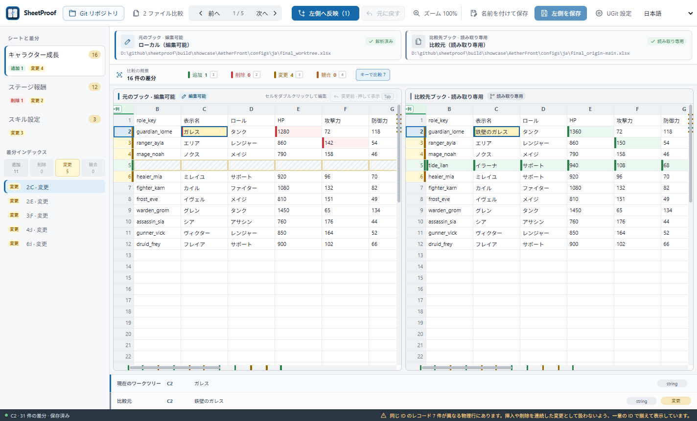

<!-- Generated from product facts and locale content. Do not edit directly. -->

[English](README.md) | [简体中文](README.zh-CN.md) | 日本語

# SheetProof（シートプルーフ）

> Git 上の XLSX 変更を確認し、必要な項目だけを反映。

SheetProof は Git ワークツリーの .xlsx と検証済みの Git リビジョンを比較し、レコードをキーで揃え、確認したセルまたは行を編集可能な左側へ反映します。

バージョン管理している設定ブックをレビューする開発者やコンテンツチーム向けです。ファイルはローカルで処理し、Excel は必要ありません。

_ローカライズしたキャラクター成長、ステージ報酬、スキル設定ブックを使用しています。_

## SheetProof が必要な理由

XLSX は圧縮された OOXML パッケージです。テキスト diff では再保存による構造差を内容変更と誤認しやすく、セルを文脈の中で選択的に反映できません。SheetProof はブックの意味を同期した 2 ペインに表示し、左側へ取り込む内容をユーザーが決められるようにします。

## キー列によるレコード照合

両側に共通する `id` 見出し、または一意で曖昧さのない `*ID` 見出しを検出します。列見出しのメニューからキー列を指定することもできます。信頼できるレコードはキーで揃え、曖昧なレコードだけを物理行で比較します。片側だけのレコードは、共通する前後のレコード付近に残ります。

## 現在の機能

- **ブック内容の比較**: シート、値、数式、明示的な空値、型を比較します。表示書式はセルが同じかどうかの判定に含めません。
- **2 ペイン差分レビュー**: 同期した仮想グリッド、差分移動、スクロールバーの印で追加・削除・変更・競合を確認します。
- **現在のシートの行絞り込み**: 確認中の元行を保ったまま、追加・削除・変更・競合を組み合わせて絞り込めます。
- **現在のシート内を検索**: 左右を別々に検索し、大文字小文字、Unicode 単語全体、RE2 正規表現を組み合わせ、絞り込み行だけにも限定できます。
- **選んで反映・元に戻す**: 選択した実際の差分だけを左側へ反映します。内容を変えない編集は未保存状態を作らず、実際の編集と反映操作は元に戻せます。
- **押している間だけ変更前を確認**: 「変更前後」を押すか、表で Tab を押している間、左側を開いた時点の状態に戻します。
- **英語・簡体字中国語・日本語**: デスクトップアプリ、CLI、ドキュメント、Web サイト、ローカライズ済みのデモブックを 3 言語で利用できます。
- **ローカル Git リポジトリモード**: 実際のワークツリーと検証済みのローカル／リモート追跡参照を、checkout、fetch、ブランチ切り替えなしで比較します。指定済みのブックと参照を読み込み終えてからワークスペースを表示します。
- **安全なローカル保存**: 外部変更を検出し、同じディレクトリの一時ファイル、再オープン検証、アトミック置換を経て保存します。

## ダウンロード

**0.5.0 プレビュー**

- [Windows amd64](https://github.com/tadazly/sheetproof/releases/download/v0.5.0/SheetProof-windows-amd64.exe)
- [macOS universal](https://github.com/tadazly/sheetproof/releases/download/v0.5.0/SheetProof-macos-universal.zip)
- [SHA256SUMS.txt](https://github.com/tadazly/sheetproof/releases/download/v0.5.0/SHA256SUMS.txt)
- [Source](https://github.com/tadazly/sheetproof/archive/refs/tags/v0.5.0.zip)

Windows 版は未署名です。macOS 版も未署名で、公証されていません。GitHub Releases から入手し、SHA-256 を確認してください。

## クイックスタート

ローカル Git リポジトリを開くか、2 つの .xlsx ブックを選びます。書き込み可能なのは左側だけで、右側は常に読み取り専用です。

## Git リポジトリモード

左側は実際のワークツリー、右側は検証済み Git オブジェクトです。fetch、checkout、ブランチ切り替え、stage、commit、push は行いません。

## 2 ファイルモード

開始画面から選ぶか、`sheetproof compare --left current.xlsx --right target.xlsx` を実行します。

## UGit

アプリを固定した場所へ置き、「UGit を設定」を実行します。*.xlsx の差分・マージ項目だけを置き換え、書き込み後に検証します。

## CLI

テキスト出力は `--lang en|zh-CN|ja` に従います。JSON のキーと列挙値は翻訳しません。

## 既知の制限

.xlsx のみ対応し、.xlsm には対応していません。SheetProof は Excel 相当のエディターではなく、グラフ、画像、ピボットテーブル、外部接続、複雑な条件付き書式などの高度なオブジェクトを完全に保持することは保証しません。

## ビルド

Go 1.24+、Node.js 20+、Wails 2.10.2 が必要です。Windows では `powershell -ExecutionPolicy Bypass -File scripts/invoke-wails.ps1 build` を使います。

## License

MIT License。Copyright (c) 2026 tadazly。
