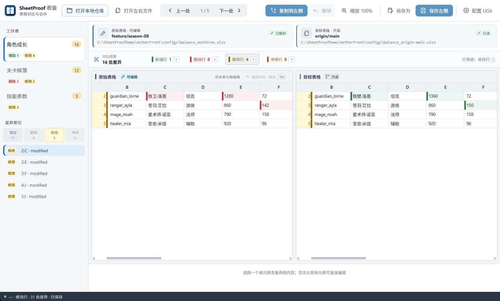
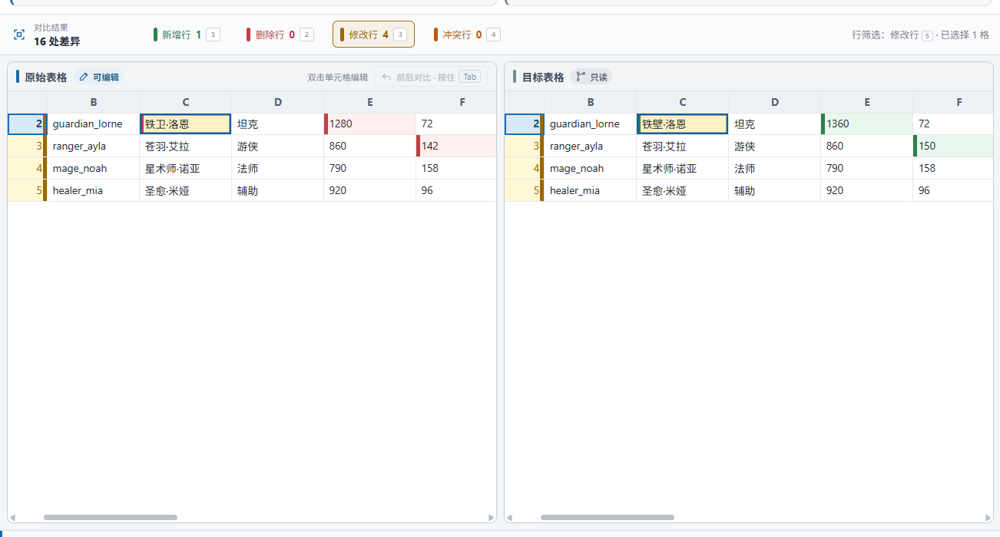
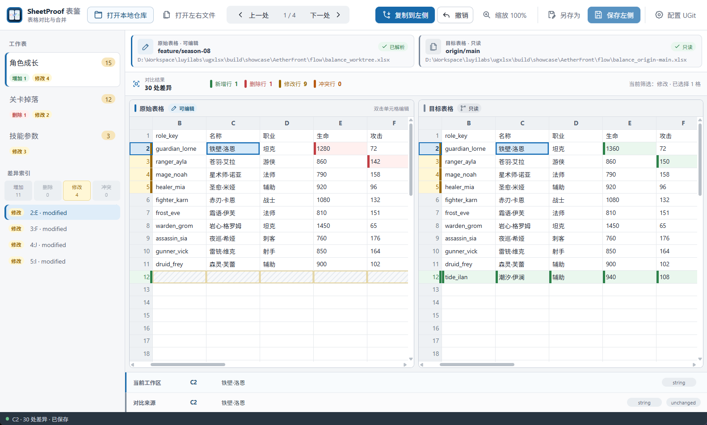

# SheetProof · 表鉴

> 看清每一处差异，再决定如何合并。

一款本地优先的 .xlsx 对比与合并桌面工具，面向双文件、Git 仓库与 UGit 工作流。 SheetProof 在本机读取工作簿，不依赖 Excel；桌面界面和 CLI 复用同一套 Go 差异、合并、撤销与安全保存核心。

[下载与发布](#下载与发布) · [快速开始](#快速开始) · [使用方式](#使用方式) · [架构说明](docs/architecture.md) · [更新日志](CHANGELOG.md)

[](site/public/screenshots/sheetproof-game-balance-overview.png)

> 示例展示角色成长、关卡掉落和技能参数配置。截图可点击或单独打开查看原始尺寸。

## 为什么做这个工具

`.xlsx` 是压缩的 OOXML 包。普通文本 diff 很容易把重新保存产生的结构噪声当成变化，也无法在单元格上下文中完成选择性合并。SheetProof 直接读取工作簿语义，把当前文件和目标版本放进同步双栏网格中，并让用户明确决定哪些修改进入左侧结果。

它特别适合把游戏配置表、运营表或其他需要进入 Git 的工作簿纳入正常的变更审阅流程。

## 使用流程

1. 打开左右两个 `.xlsx`，或从本地 Git 仓库选择工作区文件和对比引用。
2. 按修改、增加、删除或冲突筛选，核对左右值与类型。

[](site/public/screenshots/sheetproof-review-difference.png)

3. 把确认过的单元格或整行复制到左侧，必要时撤销，然后保存左侧结果。

[](site/public/screenshots/sheetproof-merge-result.png)

## 核心特性

- **理解工作簿语义的对比**：按工作表、值、公式、显式空值、类型与工作表顺序比较，不把 OOXML 文本噪声当成业务差异。
- **双栏差异审阅**：使用同步滚动的窗口化双栏网格，按增加、删除、修改和冲突分类定位真实差异。
- **可控合并与撤销**：只把选中的单元格或行合并到可写左侧，记录处理结果，并让编辑与合并都可撤销。
- **按住就能回看修改前**：改完不放心时，按住左侧的“前后对比”，或在任一表格聚焦后按住 Tab，就能暂时看到刚打开时的原样；松手马上回到最新结果，改过的格子也会单独标出来。
- **本地 Git 仓库模式**：左侧读取真实工作区，右侧从已验证的本地 Git 引用读取；不 checkout、不 fetch、不改分支。
- **安全的本地保存**：保存前检测外部修改，经过同目录临时文件、重开校验、同步与原子替换写回。

此外，应用支持双文件直接对比、Git/UGit 只读差异入口、单元格与整行合并、冲突行追加、会话撤销、JSON/text CLI 报告，以及外部修改检测。

## 适用场景

- **审阅配置表变更**：在提交或发版前核对数值、公式、类型与行级变化。
- **处理 Git 中的 XLSX 变化**：直接比较工作区与本地分支或远端跟踪引用，不切换当前分支。
- **选择性合并修正**：把确认过的单元格或整行复制到左侧，并在保存前随时撤销。

## 下载与发布

当前版本是 **0.1.0 Preview**。Windows 与 macOS 桌面安装包正在建设中。

- [查看 GitHub Releases](https://github.com/tadazly/ugxlsx/releases)：安装包发布后可在这里下载。
- [下载源码](https://github.com/tadazly/ugxlsx/archive/refs/heads/main.zip)：用于本地构建与开发。
- 维护者可按照 [发布指南](docs/releasing.md) 制作发行包并更新下载地址。

## 快速开始

要求 Go 1.24+、Node.js 20+。Windows 使用仓库内的离线优先 Wails 启动器：

```powershell
powershell -ExecutionPolicy Bypass -File scripts/invoke-wails.ps1 build
.\build\bin\SheetProof.exe
```

macOS/Linux 构建：

```bash
cd frontend
npm install
npm run build
cd ..
go run github.com/wailsapp/wails/v2/cmd/wails@v2.10.2 build
```

桌面产物位于 `build/bin`。源码构建面向 Windows 与 macOS；Linux 暂无发行包。

## 使用方式

### 打开本地 Git 仓库

1. 选择或拖入本地仓库，应用会定位仓库根目录。
2. 从只包含 `.xlsx` 的目录树选择工作簿。
3. 选择一个本地分支或远端跟踪引用作为右侧来源。
4. 按增加、删除、修改和冲突审阅差异；需要时把右侧单元格或整行复制到左侧。
5. 保存到当前工作区文件。SheetProof 不会自动 add、commit、push、fetch 或切换分支。

### 直接比较两个文件

在欢迎页选择“打开左右文件”，或从命令行启动：

```bash
sheetproof compare --left current.xlsx --right target.xlsx
```

左侧是唯一可写来源，右侧始终只读。所有保存都经过外部修改检测和原子替换流程。

### CLI 差异报告

```bash
sheetproof diff --left current.xlsx --right target.xlsx --format json
sheetproof diff --left current.xlsx --right target.xlsx --format text
sheetproof repo --path /path/to/repository --file config/example.xlsx --ref origin/main
```

`diff` 在“相同”和“不同”两种成功对比中都返回 0；脚本应读取 JSON 的 `equal` 字段。

## UGit 集成

把应用放到固定目录后，点击顶部“配置 UGit”即可注册当前 `.xlsx` 差异与合并工具。应用只更新 XLSX 对应项，写入后重新读取校验，失败时恢复原配置。UGit 从变更列表对比真实工作区时，SheetProof 会在核对仓库 Git 目录后把工作区放到可编辑左侧，保存仍需用户明确操作；两个历史版本或无法确认写入目标的差异会话继续保持双侧只读。合并会话只有在用户明确保存后才写入 Git 提供的输出路径。

详细参数、可写判定、只读回退和手工配置方法见 [UGit 使用说明](docs/ugit-integration.md)。

## 项目结构

```text
internal/       Go 领域核心：workbook、diff、merge、history、storage、repository
frontend/       Vue 3 + TypeScript 桌面界面
site/           SheetProof 多页面官网
product/        产品名、版本、下载信息、特性与更新日志
scripts/        构建、截图、品牌资产、内容同步与发布辅助脚本
docs/           架构、验收、发布与维护文档
build/          应用图标源与本地桌面构建产物
```

架构保持两种入口共享同一个 `internal/app.Session`。完整数据流、安全边界和前后端 API 见 [docs/architecture.md](docs/architecture.md)。

## 已知限制

- 只支持 `.xlsx`；不支持 `.xls`、`.xlsm`、`.ods`、CSV 或加密工作簿。
- 不编辑图片、图表、数据透视表、宏、外部连接或复杂条件格式，也不承诺这些高级对象经 excelize 重写后的完整保真。
- 不提供重做、Excel 级公式编辑器、格式工具栏或跨页差异索引 UI。
- 仓库模式不负责 fetch、pull、push、add、commit、分支管理或 Git 冲突恢复。
- 右侧独有工作表可以查看，但当前没有一键复制整个工作表。

## Roadmap

- 建立可复现、签名的 Windows/macOS GitHub Releases。
- 完成 Windows 与 macOS 发布环境的完整 GUI 验收矩阵。
- 为超过 10,000 条的差异索引增加分页 UI。
- 在保留请求防乱序与 Region API 的前提下继续拆分前端大型视图组件。

## FAQ

**文件会上传到服务器吗？**  不会。当前桌面工具在本机读取、比较和保存文件；官网也不接收工作簿。

**会修改我的 Git 分支或提交吗？**  不会。右侧引用通过 Git 对象读取，应用不 checkout、不 fetch，也不自动暂存或提交。

**为什么看起来相同的单元格仍可能被标记？**  相等语义包含单元格是否存在、原始值、公式和类型；底部详情会显示类型差异。

**可以直接处理含宏的文件吗？**  不可以。`.xlsm` 会在打开前被拒绝。

## 开发与验证

```bash
go test ./...
go vet ./...
cd frontend
npm run lint
npm run typecheck
npm run test
npm run build
```

影响桌面集成时还需完成 Wails 原生构建；任何 UI 改动都必须在当次桌面产物上实际操作并保存截图。完整门禁见 [AGENTS.md](AGENTS.md) 与 [手工验收清单](docs/manual-acceptance.md)。

## 内容维护

产品名、版本、下载地址、特性和截图说明维护在 `product/product.json`；版本记录维护在 `product/changelog.json`。修改后运行：

```bash
node scripts/sync-product-content.mjs
```

该脚本同步生成 README、CHANGELOG 和官网内容副本。完整发布顺序见 [docs/releasing.md](docs/releasing.md)。

## License

仓库当前没有 `LICENSE` 文件，因此源码公开不等于已经授予复制、修改或再分发许可。公开发布前请由项目维护者选择并加入明确许可证；同步后再更新 `product/product.json` 中的许可字段。
