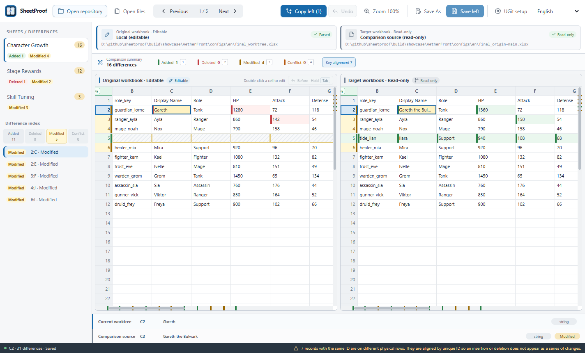

<!-- Generated from product facts and locale content. Do not edit directly. -->

English | [简体中文](README.zh-CN.md) | [日本語](README.ja.md)

# SheetProof

> Review and apply XLSX changes in Git.

SheetProof compares .xlsx workbooks in a Git worktree with validated Git revisions, aligns records by key, and applies approved changes to the editable left workbook.

For developers and content teams who review versioned configuration workbooks. Files are processed locally, and Excel is not required.

[](site/public/screenshots/en/key-alignment.png)

_The demo uses localized character growth, stage reward, and skill tuning workbooks._

## Why SheetProof

XLSX is a compressed OOXML package. Text diffs confuse serialization noise with workbook changes and cannot selectively merge cells in context. SheetProof reads workbook semantics into synchronized grids and keeps the user in control of what enters the left result.

## Key alignment

SheetProof detects a shared `id` header or one unambiguous `*ID` header. You can also choose a key column from a column header. Records with a reliable key are aligned; ambiguous records fall back to physical rows without disabling alignment for the rest of the sheet. One-sided records remain near their shared neighbors.

## Current features

- **Workbook-aware comparison**: Compare worksheets, values, formulas, explicit blanks, and types. Display formatting does not determine whether cells are equal.
- **Side-by-side review**: Use synchronized virtual grids, focused navigation, and scrollbar markers for added, deleted, modified, and conflicting data.
- **Current-sheet row filters**: Combine added, deleted, modified, and conflict filters without losing the source row being reviewed.
- **Find in the current worksheet**: Search the left and right sides independently with case, Unicode whole-word, and RE2 regular-expression options, including within filtered rows.
- **In-app help**: Use Help in the desktop toolbar to view the current version, open the guide in the active language, and check keyboard shortcuts.
- **Controlled merge and undo**: Write only selected differences to the left; unchanged edits create no unsaved state, while real edits and merges remain undoable.
- **Hold to compare before and after**: Hold Before/After or Tab in a grid to see the left workbook exactly as it was opened.
- **English, Chinese, and Japanese**: Use the desktop app, CLI, documentation, website, and localized demonstration workbooks in English, Simplified Chinese, or Japanese.
- **Local Git repository mode**: Read the real worktree against a validated local or remote-tracking reference without checkout, fetch, or branch switching. A preselected workbook and revision finish loading before the workspace is shown.
- **Guarded local saving**: Detect external changes, write a temporary file in the same directory, reopen it for validation, then replace the original atomically.

## Download

**0.6.0 Preview**

- [Windows amd64](https://github.com/tadazly/sheetproof/releases/download/v0.6.0/SheetProof-windows-amd64.exe)
- [macOS universal](https://github.com/tadazly/sheetproof/releases/download/v0.6.0/SheetProof-macos-universal.zip)
- [SHA256SUMS.txt](https://github.com/tadazly/sheetproof/releases/download/v0.6.0/SHA256SUMS.txt)
- [Source](https://github.com/tadazly/sheetproof/archive/refs/tags/v0.6.0.zip)

## First launch on Windows and macOS

SheetProof is currently an unsigned preview. Windows and macOS may show a security warning the first time you open it because the system cannot verify the publisher. This warning does not by itself mean that the system found malware.

Download SheetProof only from this project's GitHub Releases. If the system explicitly reports malware or a damaged file, stop and download it again.

### Windows

The current executable is not code-signed, so Windows may identify it as an unrecognized app or show an unknown publisher.

1. Download and double-click `SheetProof-windows-amd64.exe`.
2. If Windows says it protected your PC, select **More info**.
3. Select **Run anyway**.

If **Run anyway** is unavailable, Smart App Control or an organization policy may be blocking the app. Contact your administrator; do not disable Windows security globally just to run SheetProof.

### macOS

The current app is not signed with an Apple Developer ID and is not notarized, so Gatekeeper cannot automatically verify the developer or notarization status.

1. Download and extract `SheetProof-macos-universal.zip`.
2. Move `SheetProof.app` to **Applications**, then double-click it.
3. If macOS blocks it, open **System Settings → Privacy & Security**.
4. In the Security section, find SheetProof, select **Open Anyway**, authenticate, then select **Open**.

If **Open Anyway** is not visible, try opening SheetProof once more and return to Privacy & Security. A managed Mac may require administrator approval.

## Optional download verification

For an additional integrity check, compare the downloaded file with `SHA256SUMS.txt` from the same GitHub Release.

**Windows**

```powershell
(Get-FileHash .\SheetProof-windows-amd64.exe -Algorithm SHA256).Hash
```

**macOS**

```bash
shasum -a 256 SheetProof-macos-universal.zip
```

If the values do not match, do not run the file. Download it again from GitHub Releases.

## Quick start

Open a local Git repository, or choose two .xlsx workbooks. The left side is the only writable source; the right side is always read-only.

## Git repository mode

Repository mode reads the real worktree on the left and a validated Git object on the right. It does not fetch, checkout, switch, stage, commit, or push.

## Direct-file mode

Use the welcome screen or run `sheetproof compare --left current.xlsx --right target.xlsx`.

## UGit

Place the app in a stable location, then use Configure UGit. SheetProof replaces only *.xlsx diff and merge entries and verifies the result.

## CLI

Text output follows `--lang en|zh-CN|ja`; JSON keys and enum values remain language-independent.

## Known limitations

Only .xlsx is supported; .xlsm is not supported. SheetProof is not an Excel-level editor and does not guarantee full fidelity for charts, images, pivot tables, external connections, or complex conditional formatting.

## Build

Requires Go 1.24+, Node.js 20+, and Wails 2.10.2. On Windows use `powershell -ExecutionPolicy Bypass -File scripts/invoke-wails.ps1 build`.

## License

MIT License. Copyright (c) 2026 tadazly.
