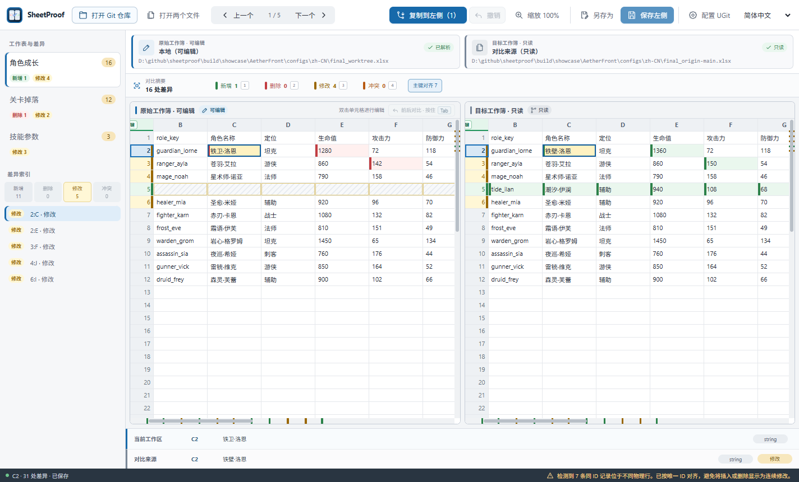

<!-- Generated from product facts and locale content. Do not edit directly. -->

[English](README.md) | 简体中文 | [日本語](README.ja.md)

# SheetProof · 表鉴

> Git 工作流中的 XLSX 差异审阅工具。

SheetProof 比较 Git 工作区中的 .xlsx 与经过校验的 Git 版本，按主键对齐记录，并将确认的单元格或整行应用到可编辑左侧。

适合需要审阅版本化配置表的开发者和内容团队。文件只在本机处理，也不依赖 Excel。

[](site/public/screenshots/zh-CN/key-alignment.png)

_演示使用本地化的角色成长、关卡掉落和技能参数工作簿。_

## 为什么需要 SheetProof

XLSX 是压缩的 OOXML 包。文本 diff 容易把序列化噪声误判为工作簿变化，也无法在单元格上下文中选择性合并。SheetProof 读取工作簿语义，以同步双栏呈现，并由用户决定哪些内容进入左侧结果。

## 主键对齐

SheetProof 会识别双方共同的 `id` 表头，或唯一且无歧义的 `*ID` 表头；也可从列标题菜单指定主键列。可靠记录按主键对齐，歧义记录仅自身回退物理行，不会让整张表放弃对齐。单侧记录会保留在相邻共同记录附近。

## 当前功能

- **理解工作簿语义的对比**: 比较工作表、值、公式、显式空值和类型；显示格式不参与相等判断。
- **双栏差异审阅**: 使用同步虚拟网格、差异导航和滚动条标记核对新增、删除、修改与冲突。
- **当前工作表行筛选**: 组合筛选新增、删除、修改和冲突，同时保留正在核对的来源行。
- **当前工作表查找**: 左右独立搜索，支持大小写、Unicode 全词和 RE2 正则选项，并可限定在当前差异行筛选范围内。
- **应用内帮助**: 从桌面工具栏打开帮助，可查看当前版本、按当前语言打开官网使用说明，并查看快捷键。
- **可控合并与撤销**: 只把选中的真实差异写入左侧；未改变内容的编辑不产生未保存状态，实际编辑和合并仍可撤销。
- **按住回看修改前**: 按住“前后对比”或在表格内按住 Tab，可查看左侧工作簿刚打开时的状态。
- **英语、简体中文和日语**: 桌面应用、CLI、文档、官网和本地化演示工作簿均可使用英语、简体中文或日语。
- **本地 Git 仓库模式**: 比较真实工作区与经过校验的本地或远端跟踪引用，不 checkout、fetch 或切换分支；预选工作簿与引用加载完成后才显示工作区。
- **安全的本地保存**: 检测外部修改，并经过同目录临时文件、重开校验和原子替换完成保存。

## 下载

**0.6.0 预览版**

- [Windows amd64](https://github.com/tadazly/sheetproof/releases/download/v0.6.0/SheetProof-windows-amd64.exe)
- [macOS universal](https://github.com/tadazly/sheetproof/releases/download/v0.6.0/SheetProof-macos-universal.zip)
- [SHA256SUMS.txt](https://github.com/tadazly/sheetproof/releases/download/v0.6.0/SHA256SUMS.txt)
- [Source](https://github.com/tadazly/sheetproof/archive/refs/tags/v0.6.0.zip)

## Windows 与 macOS 首次打开

SheetProof 当前是未签名的预览版，因此 Windows 和 macOS 在首次打开时可能显示安全提示。这是因为系统暂时无法验证应用发布者，并不代表系统已经确认应用含有恶意软件。

请只从本项目的 GitHub Releases 下载 SheetProof。如果系统明确报告恶意软件或文件损坏，请停止运行并重新下载。

### Windows

当前可执行文件尚未进行代码签名，因此 Windows 可能将它显示为无法识别的应用或未知发布者。

1. 下载并双击 `SheetProof-windows-amd64.exe`。
2. 如果出现“Windows 已保护你的电脑”，点击**更多信息**。
3. 点击**仍要运行**。

如果没有“仍要运行”按钮，设备可能启用了 Smart App Control 或组织安全策略。请联系系统管理员；不建议为了运行 SheetProof 全局关闭 Windows 安全功能。

### macOS

当前应用尚未使用 Apple Developer ID 签名，也未经过 Apple 公证，因此 Gatekeeper 无法自动验证开发者和公证状态。

1. 下载并解压 `SheetProof-macos-universal.zip`。
2. 将 `SheetProof.app` 移到“应用程序”，然后双击打开。
3. 如果系统阻止打开，请进入“系统设置 → 隐私与安全性”。
4. 在“安全性”区域找到 SheetProof，点击“仍要打开”，完成验证后再次点击“打开”。

如果没有看到“仍要打开”，请再次尝试打开 SheetProof，然后立即返回“隐私与安全性”。受公司或学校管理的 Mac 可能需要管理员授权。

## 下载文件校验（可选）

如果需要进一步确认下载文件与 GitHub Release 中发布的文件一致，可以将计算结果与同一版本的 `SHA256SUMS.txt` 对照。

**Windows**

```powershell
(Get-FileHash .\SheetProof-windows-amd64.exe -Algorithm SHA256).Hash
```

**macOS**

```bash
shasum -a 256 SheetProof-macos-universal.zip
```

如果两者不一致，请不要运行该文件，并重新从 GitHub Releases 下载。

## 快速开始

打开本地 Git 仓库，或选择两个 .xlsx 工作簿。左侧是唯一可写来源，右侧始终只读。

## Git 仓库模式

仓库模式左侧读取真实工作区，右侧读取经过校验的 Git 对象；不会 fetch、checkout、切换分支、暂存、提交或推送。

## 双文件模式

可使用欢迎页，或运行 `sheetproof compare --left current.xlsx --right target.xlsx`。

## UGit

把应用放在固定位置后使用“配置 UGit”。SheetProof 只替换 *.xlsx 差异与合并项，并在写入后校验。

## CLI

文本输出遵循 `--lang en|zh-CN|ja`；JSON 字段和枚举值保持语言无关。

## 已知限制

只支持 .xlsx，不支持 .xlsm。SheetProof 不是 Excel 级编辑器，也不保证图表、图片、数据透视表、外部连接或复杂条件格式等高级对象能够完整保真。

## 构建

需要 Go 1.24+、Node.js 20+ 和 Wails 2.10.2。Windows 使用 `powershell -ExecutionPolicy Bypass -File scripts/invoke-wails.ps1 build`。

## License

MIT License。Copyright (c) 2026 tadazly。
